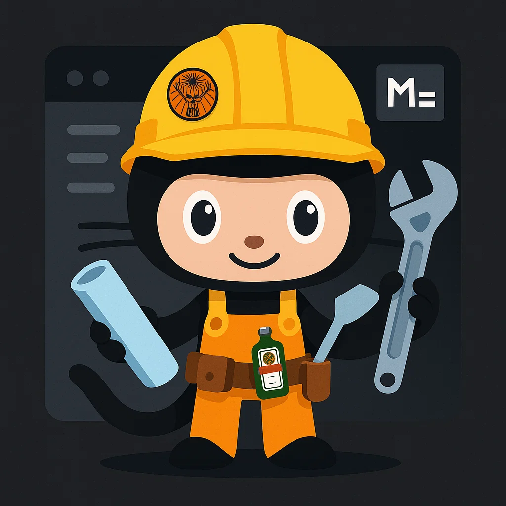

# 🚀 README Builder

<p align="center">
  
  
  
</p>

<p align="center">
  <a href="https://github.com/tobiager" target="_blank">
    
  </a>
</p>

<p align="center">
  <a href="https://github.com/tobiager">
    
  </a>
</p>

---

## 🧰 About This Repo

**README Builder** is the ultimate GitHub profile creator — combining the best of:

- 🧩 Templates inspired by `iuricode/readme-template`
- 📊 GitHub stat widgets from `anuraghazra/github-readme-stats`
- 🎖️ Badge collections from `Ileriayo/markdown-badges`
- 📦 Layout structure modeled on `othneildrew/Best-README-Template`

Whether you’re building your very first README or leveling up your personal brand, this repo gives you **everything in one place**, customizable and aesthetic.

---

## 📁 Folder Structure

```
readme-builder/
├── advanced/          # High-quality templates (minimal, creative, pro)
├── badges-shields/    # Shields.io badges by type
├── cards-status/      # GitHub stat cards: streaks, activity, langs
├── assets/            # Logos, visuals, banners
├── README.md          # This file ✨
└── LICENSE
```

---

## 🧪 How to Use

1. **Fork** or **Clone** this repo.
2. Go to `advanced/` for sample README layouts.
3. Choose badges from `badges-shields/` (grouped by tech, role, etc).
4. Pick your stats and GitHub cards from `cards-status/`.
5. Customize your README section by section:
   - About Me
   - Projects
   - Tech Stack
   - Stats
   - Contact Info
   - Extra flair (GIFs, memes, Jäger 💀)

6. Replace placeholders with your data (like `username=tobiager`).
7. Commit & Push. Done.

---

## ✨ Why Use This

- Full customization, modular components
- Avoid messy emoji-overload 🙃
- Modern aesthetic with just enough swagger
- Perfect for students, devs, freelancers or meme coders

---

## 📸 Screenshots

| Example Layout | GitHub Stats Example |
|----------------|-----------------------|
|  |  |

---

## 📝 License

MIT — feel free to use, remix, and share.  
Give a star ⭐ if you find it useful.

---

<p align="center">
  <a href="https://github.com/tobiager" target="_blank">
    
  </a>
</p>

<p align="center"><b>Built with ❤️ by <a href="https://github.com/tobiager">Tobias</a></b></p>
